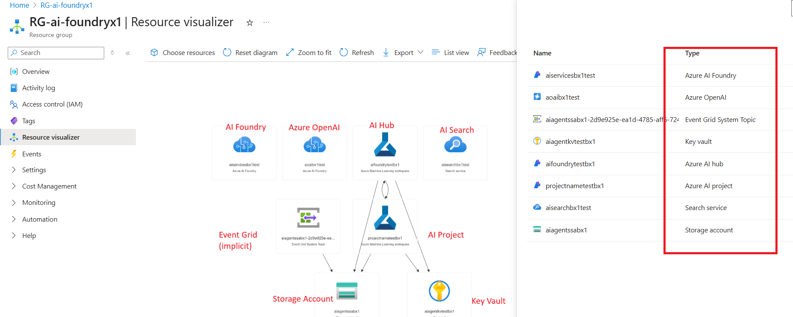
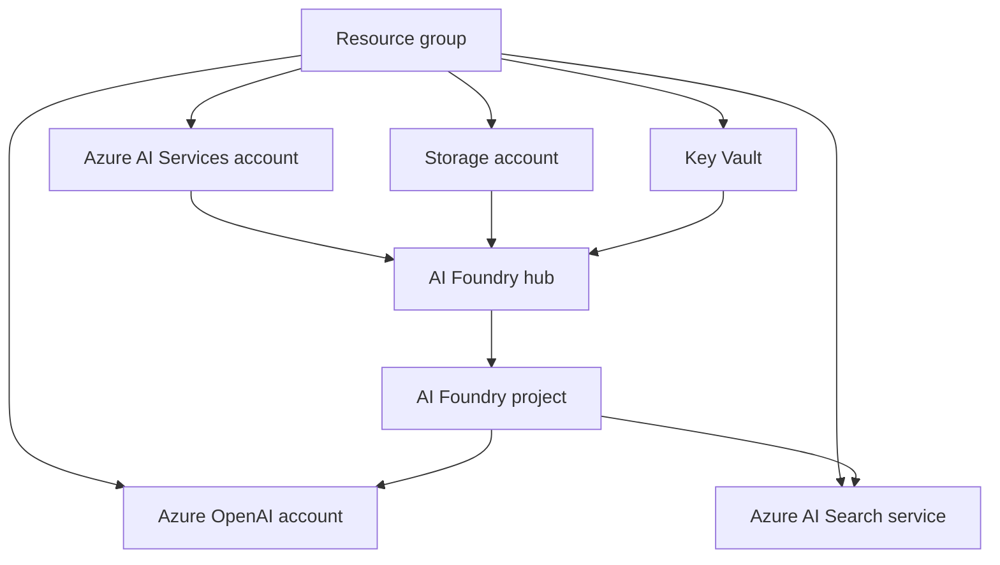

# Architecture and access

The blueprint creates an Azure AI Foundry hub and project, then connects that project to Azure OpenAI and Azure AI Search while supplying supporting Key Vault and Storage resources. Terraform also assigns the principal IDs supplied as variables to the roles used by the demonstration.

{ loading=lazy }

## Resource topology

| Resource | Purpose in this blueprint |
| --- | --- |
| Resource group | Provides the shared lifecycle boundary for the demonstration resources. |
| Azure AI Services and AI Foundry hub/project | Hosts the Foundry foundation and the project where agent work is organized. |
| Azure OpenAI | Supplies model deployments after infrastructure provisioning. |
| Azure AI Search | Supports search and retrieval scenarios after an index is created. |
| Key Vault and Storage | Supply supporting secret and storage capabilities to the hub. |

## Required access

The Terraform configuration creates role assignments at the resource-group scope for the principal IDs provided in `terraform.tfvars`.

| Role | Intended purpose |
| --- | --- |
| `Azure AI Developer` | Allows the designated developer principal to work with Azure AI resources. |
| `Cognitive Services OpenAI User` | Allows the configured OpenAI user principal to use Azure OpenAI. |

!!! warning
    Confirm the correct principal type and least-privilege scope before applying. This demo uses resource-group scope; production implementations often need more deliberate role boundaries and managed identities.

## Post-provisioning actions

After Terraform creates the infrastructure, deploy a suitable chat model such as GPT-4o-mini, deploy an embedding model appropriate for the selected approach, and create the Azure AI Search index. Model availability, deployment names, and quotas vary by region and subscription.