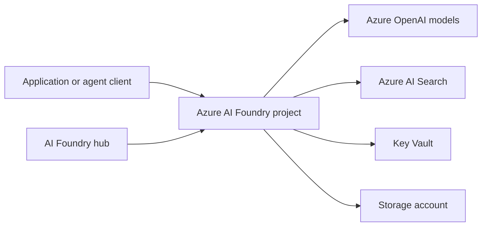

# Azure AI Agent Infrastructure Blueprint

This demonstration provisions the Azure foundation for a generative AI agent using Azure AI Foundry, Azure OpenAI, Azure AI Search, Key Vault, and Storage. It is a Terraform blueprint for learning and experimentation, not a production-ready network design.

!!! danger
    This implementation is configured for a public network demonstration. Before any production use, redesign access, identity, data protection, monitoring, cost controls, and disaster recovery for your organization's requirements.

{ loading=lazy }

  <a class="guide-card" href="architecture-and-access/"><strong>Architecture and access</strong>Review the resource topology, hub/project roles, connections, and required RBAC.</a>
  <a class="guide-card" href="terraform-deployment/"><strong>Terraform deployment</strong>Configure variables, authenticate to Azure, review the plan, and provision the blueprint.</a>
  <a class="guide-card" href="production-hardening/"><strong>Production hardening</strong>Replace the public-network demonstration assumptions with a secure and operated design.</a>

## Start here

| Need | Start with |
| --- | --- |
| Understand which Azure resources are provisioned | [Architecture and access](architecture-and-access.md) |
| Create the demonstration infrastructure | [Terraform deployment](terraform-deployment.md) |
| Adapt the blueprint for a real workload | [Production hardening](production-hardening.md) |

## Prerequisites

- An Azure subscription and permissions to create resources in the intended scope.
- [Terraform](https://developer.hashicorp.com/terraform/install) 1.8 or later and the [Azure CLI](https://learn.microsoft.com/cli/azure/install-azure-cli).
- Appropriate object IDs for the Azure AI Developer and Cognitive Services OpenAI User role assignments.

The original [repository README](https://github.com/Cloud2BR-MSFTLearningHub/AI-Agent-Infra-Blueprint/blob/main/README.md) and [Terraform templates](https://github.com/Cloud2BR-MSFTLearningHub/AI-Agent-Infra-Blueprint/tree/main/terraform-infrastructure) remain the source of truth for the demonstration.