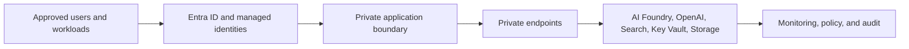

# Production hardening

The provided Terraform is intentionally a public-network demonstration. Production agent systems require a deliberate architecture that addresses network isolation, identity, data governance, observability, availability, and operational ownership.

## Network and identity

- Use virtual networks, private endpoints, private DNS, and controlled egress instead of public service exposure where the workload requires it.
- Prefer managed identities and RBAC over stored secrets. Keep any required secrets in Key Vault and grant the smallest feasible permissions.
- Scope access at the resource or project level where appropriate rather than granting broad resource-group roles by default.

## Data and AI governance

- Classify data before placing it in prompts, indexes, logs, storage, or evaluation datasets.
- Establish retention, encryption, backup, and deletion requirements for both source data and agent traces.
- Review model deployment availability, content filtering, grounding, evaluation, and human oversight for the intended use case.

## Reliability, cost, and operations

| Area | Production decision |
| --- | --- |
| Availability | Define service-level objectives, regional strategy, and dependency failure behavior. |
| Observability | Centralize diagnostic logs, metrics, alerts, cost signals, and AI-quality telemetry. |
| Cost | Set budgets and alerts; review search SKU, model usage, storage, and network costs. |
| Delivery | Use reviewed infrastructure changes, environment separation, and repeatable deployment pipelines. |
| Recovery | Document restore, rebuild, key rotation, and incident procedures; test them regularly. |

!!! note
    For current implementation guidance, consult [Azure AI Foundry documentation](https://learn.microsoft.com/azure/ai-services/agents/), [Azure OpenAI RBAC guidance](https://learn.microsoft.com/azure/ai-services/openai/how-to/role-based-access-control), and your organization's security and compliance standards.