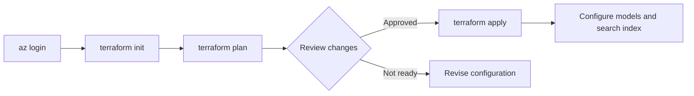

# Terraform deployment

The Terraform configuration requires Terraform `>= 1.8, < 2.0`, AzureRM `~> 4.30.0`, and AzureAD `~> 2.38.0`. It creates the resource group, supporting services, AI Foundry hub/project, and demonstration role assignments.

{ loading=lazy }

## Configure variables

Create a local `terraform.tfvars` file from the variables declared in [`terraform-infrastructure/variables.tf`](https://github.com/Cloud2BR-MSFTLearningHub/AI-Agent-Infra-Blueprint/blob/main/terraform-infrastructure/variables.tf). Provide the subscription, resource names, region, and principal/object IDs deliberately. Do not commit this file if it contains environment-specific or sensitive values.

```hcl
subscription_id        = "00000000-0000-0000-0000-000000000000"
location               = "East US"
resource_group_name    = "rg-ai-agent-demo"
developer_principal_id = "00000000-0000-0000-0000-000000000000"
openai_user_object_id  = "00000000-0000-0000-0000-000000000000"
```

Use Azure CLI to find Entra user object IDs when required:

```sh
az ad user list --query "[].{Name:displayName, ObjectId:id, Email:userPrincipalName}" --output table
```

## Deploy sequence



```sh
cd terraform-infrastructure
az login
terraform init
terraform plan -var-file terraform.tfvars
terraform apply -var-file terraform.tfvars
```

!!! warning
    Review the Terraform plan before applying it. The template creates billable Azure resources, including Azure AI Search with the `standard` SKU and Azure OpenAI. Validate regional availability, quotas, service pricing, resource names, and role assignments first.

## Remove the demonstration

When the demonstration is no longer required, review dependent resources and then remove Terraform-managed infrastructure:

```sh
terraform destroy -var-file terraform.tfvars
```

See the source [Terraform guide](https://github.com/Cloud2BR-MSFTLearningHub/AI-Agent-Infra-Blueprint/blob/main/terraform-infrastructure/README.md), [main configuration](https://github.com/Cloud2BR-MSFTLearningHub/AI-Agent-Infra-Blueprint/blob/main/terraform-infrastructure/main.tf), and [outputs](https://github.com/Cloud2BR-MSFTLearningHub/AI-Agent-Infra-Blueprint/blob/main/terraform-infrastructure/outputs.tf) for the complete implementation.